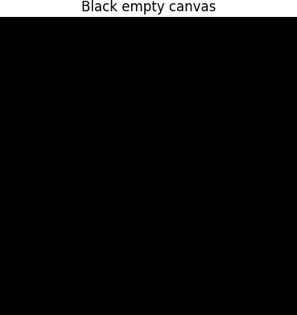
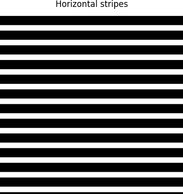
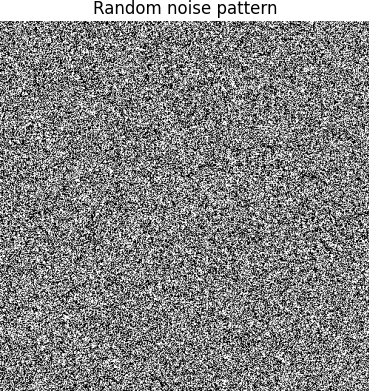
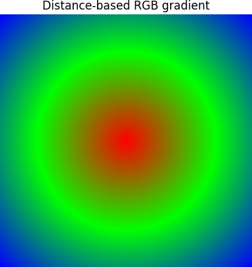
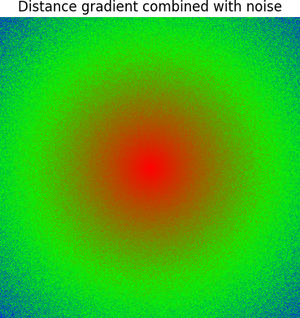

# Documentation for Assignment 1

This is the documentation of assignment 1. where the focus was on using NumPy Array Manipulation for 2D Pattern Generation

## Table of Contents

- [Pseudo-Code](#pseudo-code)
- [Technical Explanation](#technical-explanation)
- [Results](#results)
- [References](#references)

---

## Pseudo-Code

1. **Setting up the canvas**
   - Set canvas dimensions (height and width).
   - create an empty canvas filled with zeros (working in RGB).

2. **Display empty black canvas**
   - use **Matplotlib** to show the black canvas
   - add a title to the canvas
   - turn off the axis 


3. **create a horizontal striped pattern**
   - **For** every 40 pixels down the image
         - color the next 15 pixels in white
   - use **Matplotlib** to show the striped canvas
   - add a title to the canvas
   - turn off the axis 

4. **Create a noise pattern using random**
   - Create a 2D array of random values containing either 0 (black) or 255 (white)
   - Stack the array into 3 layers representing RGB
   - use **Matplotlib** to show the striped canvas
   - add a title to the canvas
   - turn off the axis 

5. **Create a color gradient based on distance**
   - Make a new empty RGB canvas
   - Define the center point of the image (middle of width and height).
   - Calculate the maximum possible distance from the center to a corner 

6. **Aplly distance-based coloring using RGB**
   - **For** each pixel (x, y) in the canvas
      - Calculate the distance from the pixel to the center
      - Normalize this distance to a value between 0 and 1 (0 = center, 1 = corner)

   - **If** the normalized distance is between 0 and 0.5
      - blend the color from red to green 

   - **Else** (distance between 0.5 and 1)
      - blend the color from green to blue


7. **Display the final gradient pattern**
   - Use Matplotlib to display the image
   - add a title to the canvas
   - turn off the axis 


8. **Save the images to a folder**
   - Save the image to the `images/` folder.

---

## Technical Explanation

In this assignment, i started by creating a blank (black) RGB canvas, i choose to keep the canvas in RGB from the begining because i knew i had to use the RGB color channel later on in the assignment. i created the blank canvas using `np.zeros()`. 

to create a striped pattern on the canvas i used slicing to define the stripes: `canvas[i:i+15, :]= 255`and after this creating a `for`loop to repet the pattern

Next, I introduced randomness by generating a black-and-white noise matrix using `np.random.choice`
because i wanted to keep working in RGB i had to convert the 2D array into an RGB canvas so i used the `np.stack`.

as the last part of the assignemnt i created a radial color gradient where i calculating the distance from each pixel to the center of the canvas. I normalized this distance to a [0, 1] to create a smooth transition between the colors, the RGB colors were definded based on the normalized distance so the pixels close to the center transitioned from red to green and the pixels farther from the center transitioned from green to blue.

Finally, I used Matplotlib's `imshow()` to show the image and `savefig()` to save it in the correct file. 


---

## Results
The results from this assignment can be seen below with a short discribtion 

*Figure 1: black empty canvas*


*Figure 2: showing a black and white stiped horizontal pattern*


*Figure 3: showing a random noise pattern*


*Figure 4: showing a RGB gradient that is based on distance*


*Figure 5: showing a combination of RGB gradient and noisepattern*

---

## References

- NumPy Documentation: [Array Manipulation Routines](https://numpy.org/doc/stable/reference/routines.array-manipulation.html)
- Creating a loop: [python for loops](https://www.w3schools.com/python/python_for_loops.asp)
- creating array: [Numpy array slicing](https://www.w3schools.com/python/numpy/numpy_array_slicing.asp?utm_source=chatgpt.com)
- creating random pattern: [Numpy.random.choice] (https://numpy.org/doc/stable/reference/random/generated/numpy.random.choice.html)
- Theory on color gradient:(https://en.wikipedia.org/wiki/Color_gradient)
- i used ChatGPT for Debuging so when my code didn't work and also to help with understandig GitHup

# Assignment 1: NumPy Array Manipulation for 2D Pattern Generation

[View on GitHub]({{ site.github.repository_url }})


## Objective

The goal of this assignment is to create a Python program using NumPy to manipulate a 2-dimensional array and transform a blank canvas into a patterned image. You are asked apply various array operations, introduce randomness, and work with RGB channels to produce full-color images.

---

## Repository structure

```
A1/
├── index.md                    # Do not edit front matter or content
├── README.md                   # Project documentation; Keep front matter, replace the rest with your project documentation
├── BRIEF.md                    # Assignment brief; Do not edit front matter or content
├── pattern_generator.py        # Your code implementation
└── images/                     # Add diagram, intermediary, and final images here
    ├── perlin_moire.png        # Assignment brief image; Do not delete
    └── ...
```

---