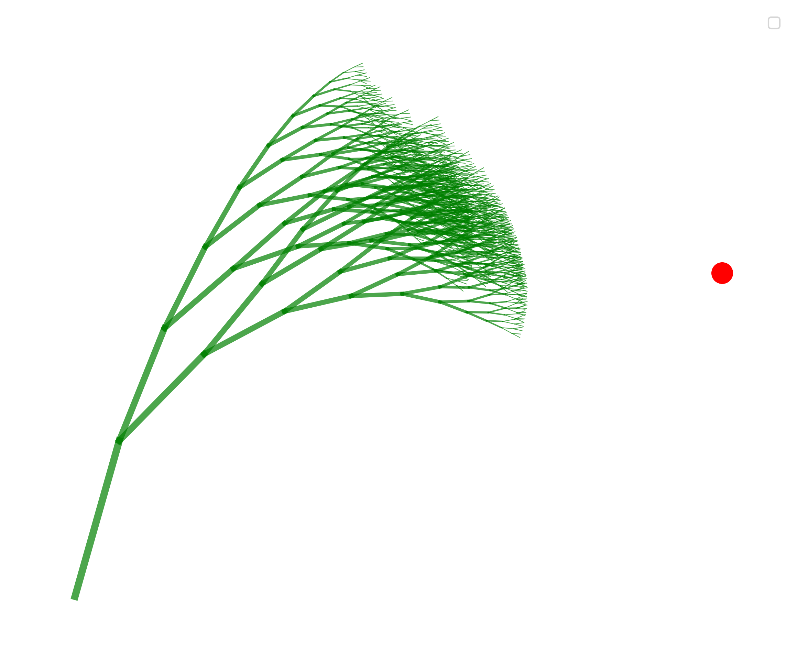
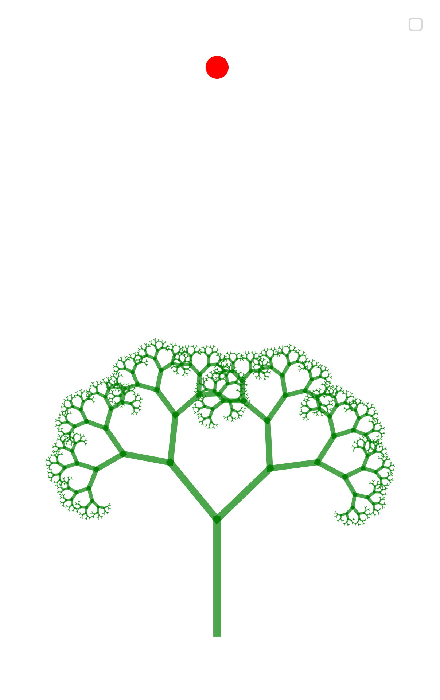
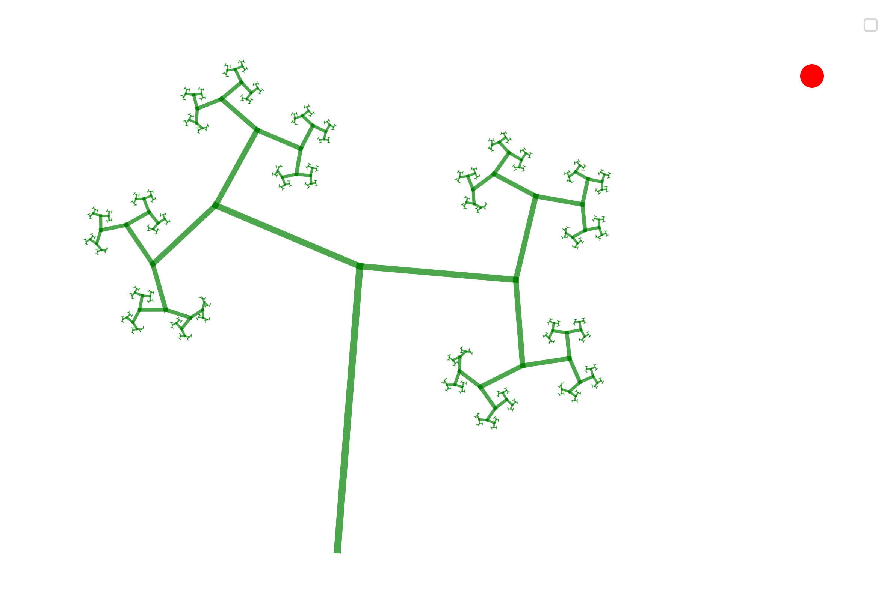
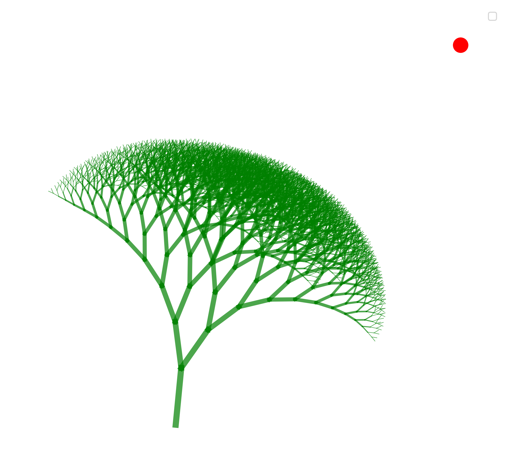

# Assignment 2: Exploring Fractals through Recursive Geometric Patterns

## Table of Contents

- [Project Overview](#project-overview)
- [Pseudo-Code](#pseudo-code)
- [Technical Explanation](#technical-explanation)
- [Design Variations](#design-variations)
- [Challenges and Solutions](#challenges-and-solutions)
- [AI Acknowledgments](#ai-acknowledgments)
- [References](#references)

---
## Project Overview

This project focuses on the generation of a parametric fractal tree using a recursive growth algorithm. Instead of a fixed structure, the tree's form is shaped by spatial influences that simulate natural growth patterns. The program uses the Shapely library to define the branch geometry as a series of connected lines. The methods for this will be explained in detail throughout the project documentation.

---

## Pseudo-code
### Pseudocode for Fractal Generator
1. **Import the necessary libraries**
   - math, matplotlib, Shapely (LineString), and random.

2. **Generating the fractal `generate_fractal(start_point, angle, length, depth, max_depth, angle_change, length_scaling_factor)`**
   
   - **Inputs**
     - `start_point`: starting coordinate for the branch (x,y)
     - `angle`: direction of the branch growth
     - `length`: length of the branch segment
     - `depth`: Int, current recursion depth
     - `max_depth`: Int, maximum recursion depth
     - `angle_change`: the change in angle at each recursion
     - `length_scaling_factor`: scaling factor for the length of the next branch
    
   - **Process**
     - **if** `depth > max_depth`:
       - **return**
     - **Else**:
       - **Calculate Spatial Influence**:
         - Find the direction to the `attractor_point` using `atan2`.
         - Adjust the current `angle` slightly toward the attractor.

       - **Calculate `end_point` using trigonometry**:
         - `end_x = start_x + length * cos(radians(angle))`
         - `end_y = start_y + length * sin(radians(angle))`

       - **Creating branching line**:
         - Create a Shapely **LineString** from `start_point` to `end_point`.
         - Store the line and `depth` for visualization.

       - **Calculate new length and depth**:
         - `new_length = length * length_scaling_factor`
         - `next_depth = depth + 1`

       - **Add Controlled Randomness**:
         - Apply `random_noise` to the angle to make it look organic.

       - **Recursive branching Calls**:
         - `generate_fractal(end_point, angle + angle_change + noise, new_length, next_depth, ...)`
         - `generate_fractal(end_point, angle - angle_change + noise, new_length, next_depth, ...)`
     - **Return** (After recursive calls).

3. **Initialize Parameters**
   - Set `start_point`, `initial_angle`, `initial_length`, `max_depth`, `angle_change`, `length_scaling_factor`.
   - Set `attractor_point` and `steering_strength`.
   - Change the values to get different outputs (Design A, B, C, D).

4. **Call `generate_fractal` Function**
   - Begin the fractal generation by calling the function with the initial parameters.

5. **Visualization**
   - Collect all the LineString shapes generated.
   - **Hierarchical Scaling**: Map the line width to the `depth` so branches get thinner as they grow.
   - Use Matplotlib to plot the lines and the attractor point.
---

## Technical Explanation

This project uses a recursive algorithm to generate a fractal tree made of Shapely LineStrings. The structure is built by calculating branch endpoints with trigonometry, where each new branch scales down in length to create a natural tapering effect.

To meet the requirements for spatial influences, I implemented an Attractor Point that pulls the branches in a specific direction. At each recursion level, the code finds the angle to this point and steers the growth towards it. I also added Controlled Randomness by injecting small, random variations into the branch angles to give the tree a more organic look. For the final visualization, I used Appearance Mapping to link the line thickness to the recursion depth, ensuring that the trunk remains thick while the outer branches become progressively thinner.

---

## Design Variations

To demonstrate the flexibility of the code, I have generated four distinct iterations by adjusting parameters such as the attractor’s position, steering strength, and branching angles.

### Parameter Tables
*(The following table outlines the specific parameters used for each iteration)*

| Design | attractorpoint | length | max depth| angle | scaling factor | strength | 
|-------:|---------------:|-------:|---------:|------:|---------------:|---------:|
| A      |200,100         |50      |10        |15     |0.75            |0.25      |
| B      |0,200           |40      |10        |45     |0.65            |0.05      |
| C      |100,100         |60      |9         | 90    | 0.55           |0.1       |
| D      |150,200         |30      |12        |25     |0.82            |0.15      |

1. **Variation A: [Strong steering and narrow angles]**

   

   *This version looks like a tree shaped by strong wind. By moving the attractor far to the right and turning up the steering strength, the branches are forced to grow in one specific direction.*

2. **Variation B: [Large branch angles and moderate scaling]**

   

   *This version looks like a wide and symatric tree. I used a large angle change to make it spread out horizontally. The attractor is placed directly above to keep the growth symmetrical and upright.*

3. **Variation C: [90-degree angles]**

   

   *This version is more sharp and abstract. By setting the angle to exactly 90 degrees, the tree turns into a more mathematical pattern than a natural one.*

4. **Variation D: [High depth and long branches]**

   

   *this version is a very dense and more complex structure. I increased the recursion depth and kept the branches long to create a more dense branching structure that still crawls toward the attractor point.*

---
## Challenges and Solutions

### Controlling the growth direction
One of the main challenges was getting the tree to grow toward a specific point instead of spreading out randomly. I solved this by calculating the angle toward an “attractor” and gradually adjusting the direction of each branch. This made it possible to shape the tree intentionally, for example to create a wind-swept look.

### Visual clarity
As the number of branches increased, the image quickly became cluttered and hard to read. To improve clarity, I used appearance hierarchical Scaling to gradually reduce the thickness of branches the further they are from the trunk. This creates a clear visual hierarchy and results in a much cleaner final image.

---
## AI Acknowledgments
AI tools were used during this project, in particular Gemini (Google) and ChatGPT (OpenAI). These tools were primarily used to help understand code-related calculations, support the overall structure of the project, and assist with debugging when error messages occurred.

The following are examples of how AI was used during the development process:

*Describe in detail what happens in this calculation and explain it in a way that is understandable for a master’s student taking their first coding course*

*i wpold like to color the structure in green, how can i implement it in my code*

*I am receiving this error — can you explain why it occurs and how I can fix it so the code runs correctly?*

---

## References

- **Shapely Manual**: [https://shapely.readthedocs.io/en/stable/manual.html](https://shapely.readthedocs.io/en/stable/manual.html)
- **Matplotlib Pyplot Tutorial**: [https://matplotlib.org/stable/tutorials/introductory/pyplot.html](https://matplotlib.org/stable/tutorials/introductory/pyplot.html)
- **fractals**: [https://natureofcode.com/fractals/] (https://natureofcode.com/fractals/)
