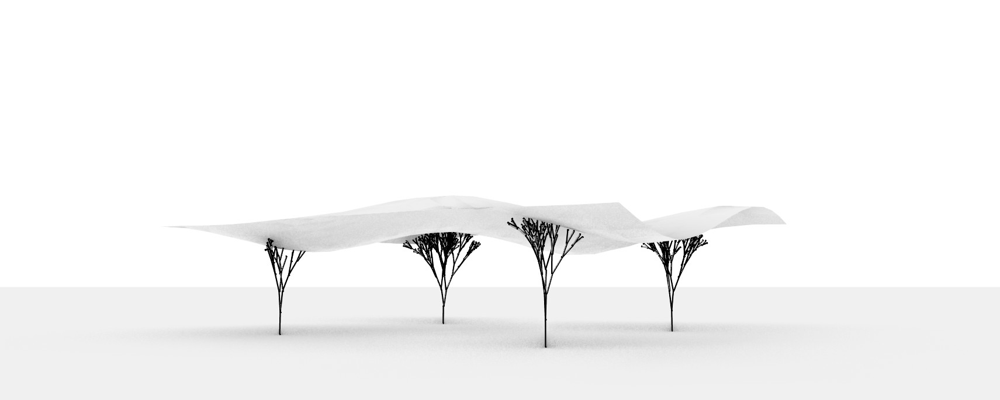
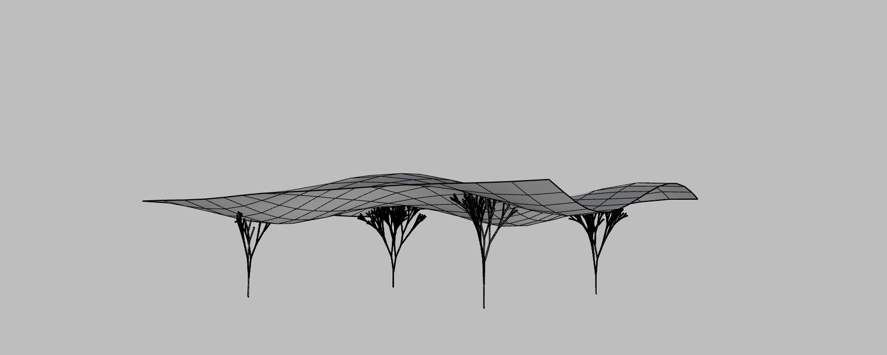
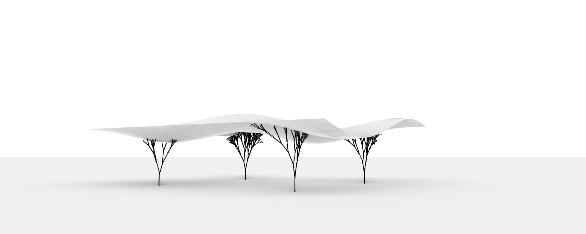
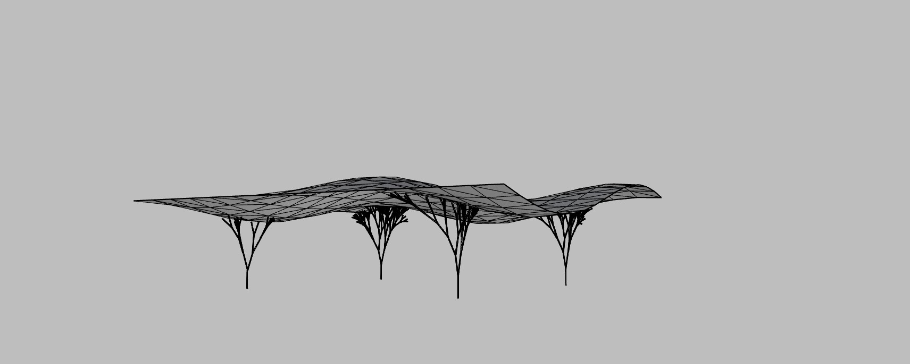
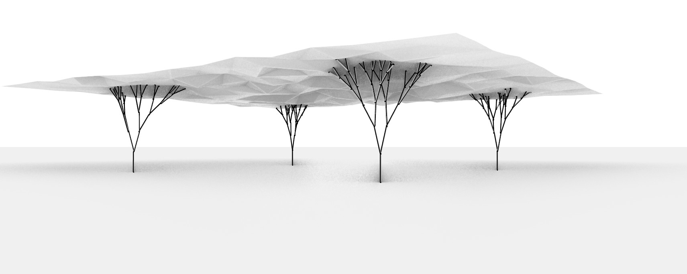
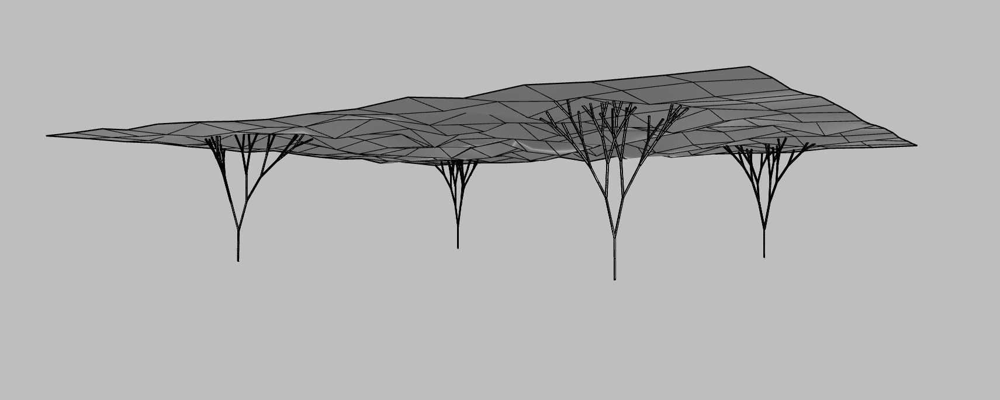
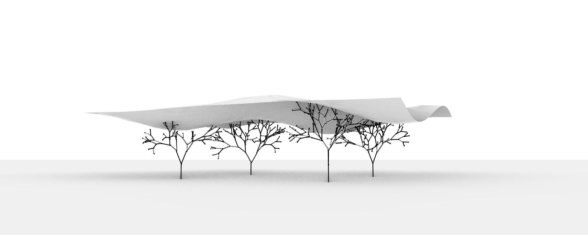
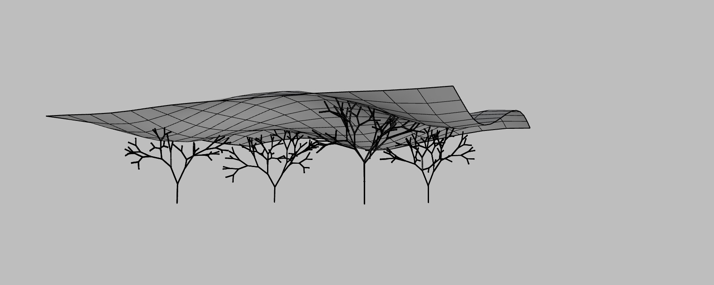

# Assignment 3: Parametric Structural Canopy

[View on GitHub]({{ site.github.repository_url }})


## Objective

In this assignment you will design and generate a **parametric structural canopy** in **Grasshopper** using the **GhPython (Python 3)** component. You will combine: (1) a **NumPy-driven heightmap** that modulates a NURBS surface, (2) **tessellation** of the resulting surface, and (3) **recursive, branching vertical supports** with controlled randomness. Your goal is to produce a small **family of design solutions** by varying parameters and algorithms, then communicate your process and results in a clear, reproducible report. You are asked to present **three** visually distinct designs. Each design must vary at least **two** of the implemented computational logic (heightmap-based surface geometry, tessellation strategy, branching supports).

---

## Repository Structure

```
A3/
├── index.md                    # Do not edit front matter or content
├── README.md                   # Project documentation; Keep front matter, replace the rest with your project documentation
├── BRIEF.md                    # Assignment brief; Do not edit front matter or content
├── parametric_canopy.py        # Your code implementation
├── parametric_canopy.gh        # Your grasshopper definition
└── images/                     # Add diagram, intermediary, and final images here
    ├── canopy.png              # Assignment brief image; Do not delete
    └── ...
```
``
## Table of Contents

- [Project Overview](#project-overview)
- [Pseudo-Code](#pseudo-code)
- [Technical Explanation](#technical-explanation)
- [Design Variations](#design-variations)
- [Challenges and Solutions](#challenges-and-solutions)
- [AI Acknowledgments](#ai-acknowledgments)
- [References](#references)

---
## Project Overview

This project explores the generation of a parametric canopy structure. The canopy surface is created as a heightmap-based mesh using NumPy. Structural supports are placed beneath the canopy to carry the surface, which functions as a roof. From these supports, branching elements are generated using a recursive growth algorithm inspired by natural tree structures. The methods for this will be explained in detail throughout the project documentation.

---

## Pseudo-Code
This project consist of two python moduls but has been combined for the documentation in the file: `parametric_canopy.py`
the two modules consist of:

- `surface_generator.py` — base surface generation using a NumPy heightmap.
- `support_generator.py` — support generation using branching logic.

The pseudo-code for each module is described in detail below.

### Surface generator (heightmap)

1. **Setting up the python component**

    Input:
    - srf (surface): Rhino surface object
    - U (int): number of divisions along U direction
    - V (int): number of divisions along V direction
    - amp (float): amplitude, maximum height displacement
    - freq_u (float): frequency of wave in U direction
    - freq_v (float): frequency of wave in V direction
    - heightmap_type (int): 
        - 0 = sinusoidal 
        - 1 = radial + noise
    - seed (int): random seed for reproducibility
    - support_height(float): height of the surface 
    
    Output:
    - pts_tree: containing the displaced 3D points 
    - edges: line objects representing the wireframe
    - mesh: mesh constructed from quad faces (tesselation 1) 
    - tri_mesh: mesh constructed from triangular faces (tesselation 2)
    

2. **Define heightmap generation logic**
    - Initialize random seed to ensure reproducibility
    - Get Surface Domains for both U and V directions (start and end parameters)
    - Create coordinate grids by generating evenly spaced values across the U and V domains
    - **If** heightmap_type is 0 (Sinusoidal):
        - Calculate height (H) using a sinewave based on U/V frequencies and amplitude

    - **Else** heightmap_type is 1 (Radial + Noise):
        - Find the center point of the U and V domains
        - Calculate the radial distance from each grid point to the center
        - Normalize distances and calculate a radial falloff (fading from center)
        - Generate a random noise array and combine it with the radial falloff and amplitude

3. **Combine surface with the heightmap**
    - **For** each coordinate pair in the U and V grids:
        - Evaluate the surface to find the 3D base point
        - Calculate the surface normal (the perpendicular direction) at that point
        - Extract the corresponding height value from the heightmap
        - Move point: Create a new 3D point by moving the base point along the normal vector by the height value
    - Store these displaced points in a 2D list (rows and columns)

4. **Generate Uniform Grid**
    - combine the surface with evenly spaced U and V parameters
    - Store the surface points as a flat reference grid

5. **Tesselation strategy**
    - Convert the structured grid of points into discrete geometric elements.
    - Connect neighboring points to form a wireframe grid (edges).
    - Group sets of four neighboring points to create quad faces (tessellation 1)
    - split each quad into two triangles to generate a triangular tessellation (tessellation 2)

6. **Move the final mesh (using offset)**
    - Take the generated mesh and calculate the direction each part is facing
    - Push every vertex of the mesh upwards by a specific support_height
    - Rebuild the mesh at this new offset position.

7. **Main execution: Output**
    - Convert the data into a format Rhino can display .
    - output: 
        - the mesh 
        - the triangular mesh
        - the wireframe edges
        - the point structure 


### Support generator (tree like structure)

1. **Setting up the python component**

    Input:
    - gen (int): generator, cotrole the growth
    - len (int): length of the support
    - angle (float): number of divisions along V direction
    - mesh (mesh): mesh from the surface generator module
    - offset_ratio (float): placement of the supports 
    - base_offset (float):  
    
    Output:
    - lines: support structure lines 
 
1. **creating the branching (growth) logic** 
    - define the grow using:
        - pt = starting point
        - V = growth direction vector
        - len = current segment length
        - g = current generation
    - **if** reached the maximum number of generations (the limit):
        - Stop the grow

    - intersection with mesh: 
        - find the closest point on the mesh 
        - calculate the distance
        - **if** distance to mesh < Len * 0.3 (0.3 can be changed) 
            - stop the grow
    
    - grow in random directions:
        - Create a random tilt to make the branching look organic
        - Calculate two new paths (Branch A and Branch B) by rotating away from the main direction.

    - Create the lines:
    - Place two new points at the end of the paths
    - Draw a line from the start to each new point

2. **Repeat (Recursion)**
    - Start the "Grow" logic again from the new points
        - For every new step, make the length slightly shorter

3. **Calculate the placement of the support**
    - find the lowest point on the mesh bounding box 
    - For each of the 4 support positions:
        - Find the midpoint of the mesh.
        - Move out toward the corners, but use an **offset ratio** to keep them inside the edges
        - Place the start point below the canopy

4. **Create the support structure**
    - for each of the 4 calculated start positions:
        - Step A: Draw a vertical line (the trunk) straight up.
        - Step B: Start the Grow logic (from Step 1) from the top of that trunk

5. **output to rhino**
- output = lines (support structure)
- connect the line output to a pipe component to visulize the structure

---

## Technical Explanation
In this assignment i combined a heightmap-based surface with a recursive branching system to create a responsive architectural canopy.

**Surface Generation**
The canopy starts as a grid of points displaced along their surface normals. I used NumPy to calculate these displacements, allowing the user to switch between a structured sinusoidal wave and a radial noise pattern. To turn these points into geometry, the script uses a dual-tessellation approach which generating both a wireframe and two types of meshes (quads and triangles).

**Branching Supports**
The support structure is built using a recursive algorithm that mimics tree growth. Starting from four base points, the code draws a vertical trunk that then splits into smaller branches. I controlled this growth using three main rules:
- Rotation: Each new generation of branches rotates outward at a set angle to create a wide crown.

- Collision Detection: The branches sense the overhead mesh so if a branch gets too close to the canopy, the recursion stops to prevent it from growing through the surface.

- Random Variation: I added small, random tilts to the growth vectors to break the symmetry and give the supports a more tree like look.

The result from this is a system where the supports automatically adapt their height and form to fit the specific canopy roof.

---

## Design Variations
To demonstrate the flexibility of the code, I have generated 4 different iterations by adjusting the key parameters 

### Parameter Tables
*(The following table outlines the specific parameters used for each iteration)*

| Design | amplitude | freq_u | freq_v| divU | divV | heightmap_type | seed | gen | len | angle | tessellation | 
|-------:|----------:|-------:|------:|-----:|-----:|---------------:|-----:|----:|----:|------:|-------------:|
| A      |10         |1.6     |type 1 | 15   | 15   |type 1          |-     |7    |9    |15     |quad          |
| B      |10         |1.6     |type 1 | 15   | 15   |type 1          |-     |7    |9    |15     |tri           |
| C      |-          |-       |type 0 | 15   | 15   |type 0          |29    |7    |9    |15     |quad          |
| D      |10         |1.6     |type 1 | 15   | 15   |type 1          |-     |6    |10   |31     |quad          |


1. **Variation A: [Heightmap type 1 and quad tessellation]**


   
   

   *Design variation A is working with a heightmap that is build on a sinus logic and a quad tessellation strategy*

2. **Variation B: [Heightmap type 1 and triangular tessellation]**

   
   

   *Design variation B is working with a heightmap that is build on a sinus logic and a triangular tessellation strategy*

3. **Variation C: [Heightmap type 0 and quad tessellation]**

   
   

   *Design variation C is working with a heightmap that is build on a combination of radial + noise pattern logic and a quad tessellation strategy*

4. **Variation D: [Heightmap type 1 and Support angle]**

   
   

   *Design variation D is working with a heightmap that is build on a sinus logic and a larger angle for the supports which creates a broader branching pattern*

---

## Challenges and Solutions

**Supports and canopy connection**
One of the challenges that I faced during this project was the connection between the canopy mesh and the support structure, because the branching structure kept growing through the canopy mesh.
 Solution: calculate the distance from the last branch to the canopy mesh and set a rule that if this distance is smaller than 0.3 (can be changed to a different number) then stop the recurtion/grow. This solution stil creates a small gab between the canopy mesh and the support structure, so for future development it would be nice to add some more rules to this logic.   
future development:
    - create a smalle connection line between the end of the branching and the canopy mesh to insure connection
    - add a rule that if the branching is intersecting with the canopy mesh the the branching will be trimmed using the canopy mesh as a trimming object.

**Placing supports under the canopy**
Another issue was ensuring the supports stayed underneath the canopy rather than growing through it. I solved this by offsetting the base surface, which allowed me to move the canopy up and down. At the same time, I modified the code so the starting points for the supports were detached from the surface itself, ensuring the structure always grows from the ground up

**Spacing between supports**
One challenge I faced was determining how to position the supports beneath the canopy. I wanted to create a flexible system where I could easily control the spacing between them. I solved this by updating the code to allow for adding or removing supports dynamically. I also integrated a slider in Grasshopper that controls an offset from the center, making it possible to precisely manage how close to the middle or the edges the supports are placed. 

---
## AI Acknowledgments
AI tools were used during this project, in particular Gemini (Google) and ChatGPT (OpenAI). These tools were primarily used to help understand code-related calculations, support the overall structure of the project, and assist with debugging when error messages occurred.

The following are examples of how AI was used during the development process:

*Describe in detail what happens in this calculation and explain it in a way that is understandable for a master’s student taking their first coding course*

*i get a error on only one of my components can you help fixing it*

*I am receiving this error — can you explain why it occurs and how I can fix it so the code runs correctly?*

*i defined all the functions i want and how they should work can you help with setting up the mathematic calculations*

---

## References
- **Documents and files from the course** 
The canopy for this project is inspired by the script provided during the course. The same underlying logic has been extended and adapted for this work. For this reason, I would like to credit my instructor, Özgüç Bertug Çapunaman, as a reference for this project.

- **Rhino documentation**: [https://developer.rhino3d.com/api/RhinoScriptSyntax/?#surface-SurfaceCurvature](https://developer.rhino3d.com/api/RhinoScriptSyntax/?#surface-SurfaceCurvature)

- **Branching tutorial**: [https://www.youtube.com/watch?v=wV6W69b-l7w](https://www.youtube.com/watch?v=wV6W69b-l7w)